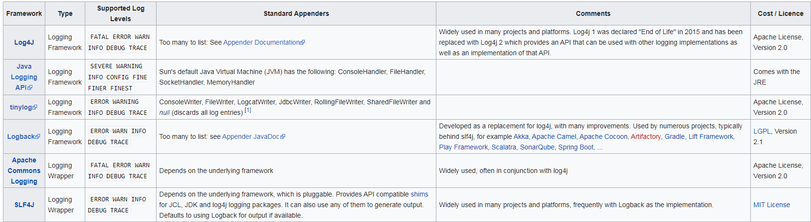

# net user /?
```
C:\Users\I5302>net user /?
這個命令的語法是:

NET USER
[username [password | *] [options]] [/DOMAIN]
         username {password | *} /ADD [options] [/DOMAIN]
         username [/DELETE] [/DOMAIN]
         username [/TIMES:{times | ALL}]
```
# powershell(電源外殼)

#應用程式怎麼紀錄log
```
jsp -> log 4 j
php -> loging
ASP.NET -> loging
```

# RAID
https://zh.wikipedia.org/wiki/RAID
```
容錯式磁碟陣列（RAID, Redundant Array of Independent Disks），舊稱容錯式廉價磁碟陣列（Redundant Array of Inexpensive Disks），簡稱磁碟陣列。利用虛擬化儲存技術把多個硬碟組合起來，成為一個或多個硬碟陣列組，目的為提升效能或資料冗餘，或是兩者同時提升。
```
