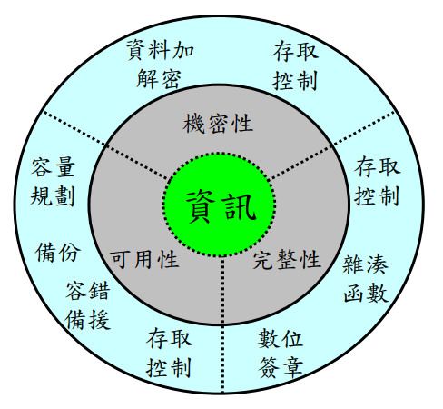

# 1-1.資訊安全管理系統(Information Security Management System, ISMS)
https://en.wikipedia.org/wiki/Information_security_management
```
一套有系統分析和管理資訊系統的方法，由英國工業貿易部倡導，並在全球推行。1995年英國提出 BS-7799 Part1成為第一個ISMS標準，如今ISO的ISO27003是新的ISMS標準。
各組織對ISMS的導入使用規劃(Plan)、執行(Do)、檢查(Check)、行動(Action)四個步驟(簡稱：PDCA)循環進行
```
### C.I.A(機密性、完整性、可用性)
```
資訊安全之本質大致可歸為以下3類：
C.機密性(Confidentiality)：確保只有經授權的人才可以取得資訊，應防止機密資訊外洩
I.完整性(Integrity)：確保資訊不受未經授權的竄改與資訊處理方法的正確性
A.可用性(Availability)：確保經授權的使用者，在需要時可以取得資訊，並使用相關資產，應避免資訊因系統故障或人為惡意的阻斷服務

除了以上3項基本性質外尚可依業務狀況考量驗證性 (authenticity)、可歸責性 (accountability)、不可否認性 (non-repudiation)或可靠性 (reliability)，其說明如下：
一、驗證性－Authenticity：
  確保使用者登入時有適當的驗證程序。
二、可歸責性－Accountability：
  確保使用者執行任何動作均有適當的軌跡可追蹤至執行者。
三、不可否認性－Non-repudiation：
  確保使用者無法否認於系統上完成的作業。
四、可靠性－Reliability：
  確保作業執行皆有一致結果。
```
### 保護資訊C.I.A.不同的技術與方法

### ISO 27000系列的資安標準
```
• ISO 27000 開頭的都是資安相關的國際標準
• 國內有相對應的翻譯 CNS 2700X
– 目的在於制定一個可用來建立、實作、運作、監視、審查、維持及改進「資訊安全管理系統」(Information Security Management System, ISMS)的模型。
• 雲端安全相關的ISO 27017與ISO 27018
– ISO/IEC 27018《公有雲個人資料(PII)處理者之個資保護作業規範》
– ISO/IEC 27017《雲端運算服務的資訊安全控制措施實務守則 》
```
# 1-2 相關法規概論與遵循
# 1-3 隱私權保護與智慧財產權
